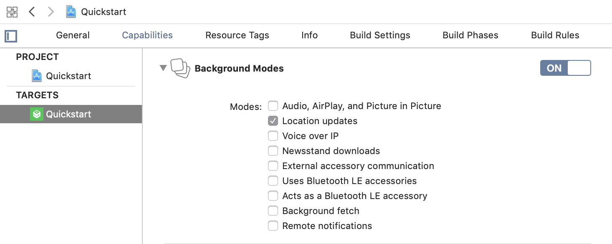
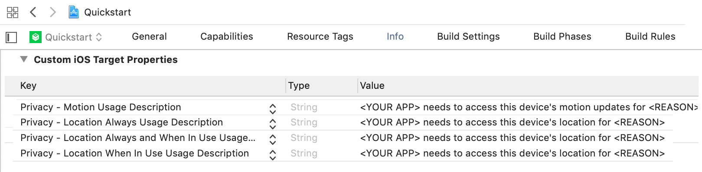

# HyperTrack iOS SDK Integration Guide

[HyperTrack](https://www.hypertrack.com) lets you add live location tracking to your mobile app.
Live location is made available along with ongoing activity, tracking controls and tracking outage with reasons.
This document contains a step by step guide how to integrate HyperTrack SDK with your app within minutes.

HyperTrack iOS SDK supports iOS 9 and above, using Swift or Objective-C.

## Create HyperTrack Account

[Sign up](https://dashboard.hypertrack.com/signup) for HyperTrack and 
get your publishable key from the [Setup page](https://dashboard.hypertrack.com/setup).

### Add HyperTrack SDK to your Podfile

We use [CocoaPods](https://cocoapods.org) to distribute the SDK, you can [install it here](https://guides.cocoapods.org/using/getting-started.html#installation).

Using command line run `pod init` in your project directory to create a Podfile. Put the following code (changing target placeholder to your target name) in the Podfile:

```ruby
platform :ios, '9.0'
inhibit_all_warnings!

target 'YourApp' do
  use_frameworks!
  pod 'HyperTrack', '4.0.1'
end
```

Run `pod install`. CocoaPods will build the dependencies and create a workspace (`.xcworkspace`) for you.

If your project uses Objective-C only, you need to configure `SWIFT_VERSION` in your project's Build Settings. Alternatively, you can create an empty Swift file, and Xcode will create this setting for you.

If you are using Xcode 10.1, which doesn't support Swift 5, add this `post_install` script at the bottom of your Podfile:

<details>
<summary>Show code block</summary>

```ruby
post_install do |installer|
  installer.pods_project.targets.each do |target|
    if ['GRDB.swift'].include? target.name
      target.build_configurations.each do |config|
        config.build_settings['SWIFT_VERSION'] = '4.2'
      end
    end
  end
end
```
</details>

### Enable background location updates

Enable Background Modes in your project target's Capabilities tab. Choose "Location updates".



### Handle location and motion permissions

Set the following purpose strings in the `Info.plist` file:



HyperTrack SDK requires "Always" permissions to reliably track user's location.
Be advised, purpose strings are mandatory.

Your app needs to make sure that it has location and motion permissions for location tracking to work. See [this F.A.Q. page](#what-are-the-best-practices-for-handling-permissions-on-ios) for details on permissions best practices.

### Initialize the SDK

Put the initialization call inside your `AppDelegate`'s `application:didFinishLaunchingWithOptions:` method:

#### Swift

<details>
<summary>Handling production/development errors:</summary>

```swift
let publishableKey = HyperTrack.PublishableKey("PASTE_YOUR_PUBLISHABLE_KEY_HERE")!

switch HyperTrack.makeSDK(publishableKey: publishableKey) {
case let .success(hyperTrack):
  // Use `hyperTrack` instance
case let .failure(fatalError):
  // Handle errors, for example using switch
}
```

</details>

<details>
<summary>Ignoring any errors:</summary>

```swift
let publishableKey = HyperTrack.PublishableKey("PASTE_YOUR_PUBLISHABLE_KEY_HERE")!

if let hyperTrack = try? HyperTrack(publishableKey: publishableKey) {
  // Use `hyperTrack` instance
}
```

</details>

#### Objective-C

Import the SDK:

```objc
@import HyperTrack;
```

Initialize the SDK.

<details>
<summary>Handling production/development errors:</summary>

```objc
NSString *publishableKey = @"PASTE_YOUR_PUBLISHABLE_KEY_HERE";

HTResult *result = [HTSDK makeSDKWithPublishableKey:publishableKey];
if (result.hyperTrack != nil) {
  // Use `hyperTrack` instance from `result.hyperTrack`
} else {
  // Handle errors, for example using switch:
  switch ([result.error code]) {
    case HTFatalErrorProductionLocationServicesUnavalible:
    case HTFatalErrorProductionMotionActivityServicesUnavalible:
      // Handle a case where device is fully untrackable (either iPhone 5 or lower
      // or not an iPhone
      break;
    case HTFatalErrorProductionMotionActivityPermissionsDenied:
      // Handle motion permissions denied error. Enabling permissions will
      // restart the app
    default:
      // Other errors should only happen during development
      break;
  }
}
```

</details>

<details>
<summary>Ignoring errors:</summary>

```objc
NSString *publishableKey = @"PASTE_YOUR_PUBLISHABLE_KEY_HERE";

HTSDK *hyperTrack = [[HTSDK alloc] initWithPublishableKey:publishableKey];
if (hyperTrack != nil) {
  // Use `hyperTrack` instance
}
```

</details>

#### NSNotifications

Restorable and Unrestorable error notifications are called if the SDK encounters an error that prevents it from tracking. SDK can recover in runtime from Restorable errors if the error reason is resolved. Errors include:
  - Initialization errors, like denied Location or Motion permissions (`RestorableError.locationPermissionsDenied`)
  - Authorization errors from the server. If the trial period ends and there is no credit card tied to the account, this is the error that will be called (`RestorableError.trialEnded`)
  - Incorrectly typed Publishable Key (`UnrestorableError.invalidPublishableKey`)

#### Swift

<details>
<summary>If you want to handle errors using the same selector:</summary>

```swift
NotificationCenter.default.addObserver(
  self,
  selector: #selector(trackingError(notification:)),
  name: HyperTrack.didEncounterUnrestorableErrorNotification,
  object: nil
)
NotificationCenter.default.addObserver(
  self,
  selector: #selector(trackingError(notification:)),
  name: HyperTrack.didEncounterRestorableErrorNotification,
  object: nil
)

...

@objc func trackingError(notification: Notification) {
  if let trackingError = notification.hyperTrackTrackingError() {
    // Handle TrackingError, which is an enum of Restorable or Unrestorable error
  }
}
```

</details>

<details>
<summary>If you want to handle errors separately, or handle only Restorable or only Unrestorable errors:</summary>

```swift
NotificationCenter.default.addObserver(
  self,
  selector: #selector(unrestorableError(notification:)),
  name: HyperTrack.didEncounterUnrestorableErrorNotification,
  object: nil
)
NotificationCenter.default.addObserver(
  self,
  selector: #selector(restorableError(notification:)),
  name: HyperTrack.didEncounterRestorableErrorNotification,
  object: nil
)

...

@objc func restorableError(notification: Notification) {
  if let restorableError = notification.hyperTrackRestorableError() {
    // Handle RestorableError
  }
}

@objc func unrestorableError(notification: Notification) {
  if let unrestorableError = notification.hyperTrackUnrestorableError() {
    // Handle UnrestorableError
  }
}
```

</details>

#### Objective-C

<details>
<summary>If you want to handle errors using the same selector:</summary>

```objc
[[NSNotificationCenter defaultCenter] addObserver:self
                                         selector:@selector(hyperTrackEncounteredTrackingError:)
                                             name:HTSDK.didEncounterRestorableErrorNotification
                                           object:nil];
[[NSNotificationCenter defaultCenter] addObserver:self
                                         selector:@selector(hyperTrackEncounteredTrackingError:)
                                             name:HTSDK.didEncounterUnrestorableErrorNotification
                                           object:nil];

...

- (void)hyperTrackEncounteredTrackingError:(NSNotification *)notification {
  // Use tracking error helper
  NSError *error = [notification hyperTrackTrackingError];
  if (error != nil) {
    if ([[error domain] isEqualToString:NSError.HTRestorableErrorDomain]) {
      // Handle restorable error
    } else if ([[error domain] isEqualToString:NSError.HTUnrestorableErrorDomain]) {
      // Handle unrestorable error
    }
  }
}

```

</details>

<details>
<summary>If you want to handle errors separately, or handle only Restorable or only Unrestorable errors:</summary>

```objc
[[NSNotificationCenter defaultCenter] addObserver:self
                                         selector:@selector(hyperTrackEncounteredRestorableError:)
                                             name:HTSDK.didEncounterRestorableErrorNotification
                                           object:nil];
[[NSNotificationCenter defaultCenter] addObserver:self
                                         selector:@selector(hyperTrackEncounteredUnrestorableError:)
                                             name:HTSDK.didEncounterUnrestorableErrorNotification
                                           object:nil];

...

- (void)hyperTrackEncounteredRestorableError:(NSNotification *)notification {
  NSError *restorableError = [notification hyperTrackRestorableError]);
  // Handle RestorableError
 }

- (void)hyperTrackEncounteredUnrestorableError:(NSNotification *)notification {
  NSError *unrestorableError = [notification hyperTrackUnrestorableError]);
  // Handle UnrestorableError
}
```

</details>

---

You can also observe when SDK starts and stops tracking and update the UI:

#### Swift

```swift
NotificationCenter.default.addObserver(
  self,
  selector: #selector(self.trackingStarted),
  name: HyperTrack.startedTrackingNotification,
  object: nil
)
NotificationCenter.default.addObserver(
  self,
  selector: #selector(self.trackingStopped),
  name: HyperTrack.stoppedTrackingNotification,
  object: nil
)
```

#### Objective-C

```objc
[[NSNotificationCenter defaultCenter] addObserver:self
                                         selector:@selector(trackingStarted)
                                             name:HTSDK.startedTrackingNotification
                                           object:nil];

[[NSNotificationCenter defaultCenter] addObserver:self
                                         selector:@selector(trackingStopped)
                                             name:HTSDK.stoppedTrackingNotification
                                           object:nil];
```

### Enable remote notifications

The SDK has a bi-directional communication model with the server. This enables the SDK to run on a variable frequency model, which balances the fine trade-off between low latency tracking and battery efficiency, and improves robustness. For this purpose, the iOS SDK uses APNs silent remote notifications.

> This guide assumes you have configured APNs in your application. If you haven't, read the [iOS documentation on APNs](https://developer.apple.com/documentation/usernotifications/registering_your_app_with_apns).

#### Configure APNs on the dashboard

Log into the HyperTrack dashboard, and open the [setup page](https://dashboard.hypertrack.com/setup). Upload your Auth Key (file in the format `AuthKey_KEYID.p8`) and fill in your Team ID.

This key will only be used to send silent push notifications to your apps.

#### Enable remote notifications in the app

In the app capabilities, ensure that **remote notifications** inside background modes is enabled.


In the same tab, ensure that **push notifications** is enabled.


#### Registering and receiving notifications

The following changes inside AppDelegate will register the SDK for push notifications and route HyperTrack notifications to the SDK.

#### Register for notifications

Inside `didFinishLaunchingWithOptions`, use the SDK method to register for notifications.

**Swift**

```swift
func application(_ application: UIApplication, didFinishLaunchingWithOptions launchOptions: [UIApplication.LaunchOptionsKey: Any]?) -> Bool {
    HyperTrack.registerForRemoteNotifications()
    return true
}
```

**Objective-C**

```objc
- (BOOL)application:(UIApplication *)application didFinishLaunchingWithOptions:(NSDictionary *)launchOptions {
    [HTSDK registerForRemoteNotifications];
    return YES;
}
```

#### Register device token

Inside and `didRegisterForRemoteNotificationsWithDeviceToken` and `didFailToRegisterForRemoteNotificationsWithError` methods, add the relevant lines so that HyperTrack can register the device token.

**Swift**

```swift
func application(_ application: UIApplication, didRegisterForRemoteNotificationsWithDeviceToken deviceToken: Data) {
    HyperTrack.didRegisterForRemoteNotificationsWithDeviceToken(deviceToken)
}

func application(_ application: UIApplication, didFailToRegisterForRemoteNotificationsWithError error: Error) {
    HyperTrack.didFailToRegisterForRemoteNotificationsWithError(error)
}
```

**Objective-C**

```objc
- (void)application:(UIApplication *)application didRegisterForRemoteNotificationsWithDeviceToken:(NSData *)deviceToken {
    [HTSDK didRegisterForRemoteNotificationsWithDeviceToken:deviceToken];
}

- (void)application:(UIApplication *)application didFailToRegisterForRemoteNotificationsWithError:(NSError *)error {
    [HTSDK didFailToRegisterForRemoteNotificationsWithError:error];
}
```

#### Receive notifications

Inside the `didReceiveRemoteNotification` method, add the HyperTrack receiver. This method parses only the notifications sent from HyperTrack.

**Swift**

```swift
func application(_ application: UIApplication, didReceiveRemoteNotification userInfo: [AnyHashable : Any], fetchCompletionHandler completionHandler: @escaping (UIBackgroundFetchResult) -> Void) {
    HyperTrack.didReceiveRemoteNotification(userInfo, fetchCompletionHandler: completionHandler)
}
```

**Objective-C**

```objc
- (void)application:(UIApplication *)application didReceiveRemoteNotification:(NSDictionary *)userInfo fetchCompletionHandler:(void (^)(UIBackgroundFetchResult))completionHandler {
    [HTSDK didReceiveRemoteNotification:userInfo fetchCompletionHandler:completionHandler];
}
```

If you want to make sure to only pass HyperTrack notifications to the SDK, you can use the "hypertrack" key:

**Swift**

```swift
func application(_ application: UIApplication, didReceiveRemoteNotification userInfo: [AnyHashable : Any], fetchCompletionHandler completionHandler: @escaping (UIBackgroundFetchResult) -> Void) {
    if userInfo["hypertrack"] != nil {
        // This is HyperTrack's notification
        HyperTrack.didReceiveRemoteNotification(userInfo, fetchCompletionHandler: completionHandler)
    } else {
        // Handle your server's notification here
    }
}
```

**Objective-C**

```objc
- (void)application:(UIApplication *)application didReceiveRemoteNotification:(NSDictionary *)userInfo fetchCompletionHandler:(void (^)(UIBackgroundFetchResult))completionHandler {
    if (userInfo[@"hypertrack"] != nil) {
        // This is HyperTrack's notification
        [HTSDK didReceiveRemoteNotification:userInfo fetchCompletionHandler:completionHandler];
    } else {
        // Handle your server's notification here
    }
}

```

### Identify devices (OPTIONAL)
All devices tracked on HyperTrack are uniquely identified using [UUID](https://en.wikipedia.org/wiki/Universally_unique_identifier). You can get this identifier programmatically in your app by calling `getDeviceId` after initialization.
Another approach is to tag device with a name that will make it easy to distinguish them on HyperTrack Dashboard.

#### Swift

```swift
hyperTrack.setDeviceName("Device name")
```

#### Objective-C

```objc
hyperTrack.deviceName = @"Device name";
```

You can additionaly tag devices with custom metadata. Metadata should be representable in JSON.


#### Swift

```swift
if let metadata = HyperTrack.Metadata(rawValue: ["key": "value"]) {
  hyperTrack.setDeviceMetadata(metadata)
} else {
  // Metadata can't be represented in JSON
}
```

#### Objective-C

```objc
NSDictionary *dictionary = @{@"key": @"value"};

HTMetadata *metadata = [[HTMetadata alloc] initWithDictionary:dictionary];
if (metadata != nil) {
  [self.hyperTrack setDeviceMetadata:metadata];
} else {
  // Metadata can't be represented in JSON
}
```

### Set a trip marker (OPTIONAL)

Use this optional method if you want to tag the tracked data with trip markers that happen in your app. E.g. user marking a task as done, user tapping a button to share location, user accepting an assigned job, device entering a geofence, etc.

The process is the same as for device metadata:

#### Swift

```swift
if let metadata = HyperTrack.Metadata(rawValue: ["status": "PICKING_UP"]) {
  hyperTrack.addTripMarker(metadata)
} else {
  // Metadata can't be represented in JSON
}
```

#### Objective-C

```objc
NSDictionary *dictionary = @{@"status": @"PICKING_UP"};

HTMetadata *metadata = [[HTMetadata alloc] initWithDictionary:dictionary];
if (metadata != nil) {
  [self.hyperTrack addTripMarker:metadata];
} else {
  // Metadata can't be represented in JSON
}

```

## Start tracking

Now the app is ready to be tracked from the cloud. HyperTrack gives you powerful APIs
to control device tracking from your backend.

> To use the HyperTrack API, you will need the `{AccountId}` and `{SecretKey}` from the [Setup page](https://dashboard.hypertrack.com/setup).

### Track devices during work

Track devices when user is logged in to work, or during work hours by calling the 
[Devices API](https://docs.hypertrack.com/#references-apis-devices).

To start, call the [start](https://docs.hypertrack.com/?shell#references-apis-devices-post-devices-device_id-start) API.

```
curl -X POST \
  -u {AccountId}:{SecretKey} \
  https://v3.api.hypertrack.com/devices/{device_id}/start
```


Get the tracking status of the device by calling
[GET /devices/{device_id}](https://docs.hypertrack.com/?shell#references-apis-devices-get-devices) api.

```
curl \
  -u {AccountId}:{SecretKey} \
  https://v3.api.hypertrack.com/devices/{device_id}
```

To see the device on a map, open the returned embed_url in your browser (no login required, so you can add embed these views directly to you web app).
The device will also show up in the device list in the [HyperTrack dashboard](https://dashboard.hypertrack.com/).

To stop tracking, call the [stop](https://docs.hypertrack.com/?shell#references-apis-devices-post-devices-device_id-stop) API.

```
curl -X POST \
  -u {AccountId}:{SecretKey} \
  https://v3.api.hypertrack.com/devices/{device_id}/stop
```

### Track trips with ETA

If you want to track a device on its way to a destination, call the [Trips API](https://docs.hypertrack.com/#references-apis-trips-post-trips)
and add destination.

HyperTrack Trips API offers extra fields to get additional intelligence over the Devices API.
* set destination to track route and ETA
* set scheduled_at to track delays
* share live tracking URL of the trip with customers 
* embed live tracking view of the trip in your ops dashboard 

```curl
curl -u {AccountId}:{SecretKey} --location --request POST 'https://v3.api.hypertrack.com/trips/' \
--header 'Content-Type: application/json' \
--data-raw '{
    "device_id": "{device_id}",
    "destination": {
        "geometry": {
            "type": "Point",
            "coordinates": [{longitude}, {latitude}]
        }
    }
}'
```

To get `{longitude}` and `{latitude}` of your destination, you can use for example [Google Maps](https://support.google.com/maps/answer/18539?co=GENIE.Platform%3DDesktop&hl=en).

> HyperTrack uses [GeoJSON](https://en.wikipedia.org/wiki/GeoJSON). Please make sure you follow the correct ordering of longitude and latitude.

The returned JSON includes the embed_url for your dashboard and share_url for your customers.

When you are done tracking this trip, call [complete](https://docs.hypertrack.com/#references-apis-trips-post-trips-trip_id-complete) Trip API using the `trip_id` from the create trip call above.
```
curl -X POST \
  -u {AccountId}:{SecretKey} \
  https://v3.api.hypertrack.com/trips/{trip_id}/complete
```

After the trip is completed, use the [Trips API](https://docs.hypertrack.com/#references-apis-trips-post-trips) to
retrieve a full [summary](https://docs.hypertrack.com/#references-apis-trips-get-trips-trip_id-trip-summary) of the trip.
The summary contains the polyline of the trip, distance, duration and markers of the trip.

```
curl -X POST \
  -u {AccountId}:{SecretKey} \
  https://v3.api.hypertrack.com/trips/{trip_id}
```

### Track trips with geofences

If you want to track a device going to a list of places, call the [Trips API](https://docs.hypertrack.com/#references-apis-trips-post-trips)
and add geofences. This way you will get arrival, exit, time spent and route to geofences. Please checkout our [docs](https://docs.hypertrack.com/#references-apis-trips-post-trips) for more details.

## Dashboard

Once your app is running, go to the [dashboard](https://dashboard.hypertrack.com/devices) where you can see a list of all your devices and their live location with ongoing activity on the map.

## Frequently Asked Questions

<details>
  <summary><b>Error: Access to Activity services has not been authorized</b></summary>
You are running the quickstart app on the iOS simulator, which currently does not support CoreMotion services. You can test the app on real iOS devices only.
</details>

<details>
  <summary><b>What are the best practices for handling permissions on iOS?</summary>
In [Human Interface Guidelines](https://developer.apple.com/design/human-interface-guidelines/ios/app-architecture/requesting-permission/) Apple recommends:
- Requesting permissions only when they are needed in the flow of the app. If you app is centered around location tracking, then asking for permissions at the app launch can be understandable for users. On the other hand, if location tracking is just one of the features, then it makes sense to request them only when the feature is activated.
- Providing short and specific purpose string. Purpose string should explain the value that location and motion tracking provides. Examples of motion tracking benefits: improves battery life by using algorithms based on motion tracking data, provides story-like details for historical tracking data, gives live feedback on current activity.

In addition a lot of great apps [provide a special screen](https://pttrns.com/?scid=56) explaining the need for permissions before asking them. If permissions are denied you can guide the user to the specific page in the Settings.app to change permissions (see [this guide](https://www.macstories.net/ios/a-comprehensive-guide-to-all-120-settings-urls-supported-by-ios-and-ipados-13-1/) for special deep-links for the Settings.app).

On iOS 13 Apple introduced a new "Provisional Always" authorization state (see [this StackOverflow answer](https://stackoverflow.com/a/58822468/1352537) for details). In short:

- there is no API to detect this state
- during this state there are no location events in background
- user sees his permissions as granted and sees "While Using" state in Settings.app
- app sees permissions as granted with "Always" state.

HyperTrack is working on ways to detect this state and provide APIs that would enable app developers to display explanation screens that will guide the user back to Settings.app to switch permissions from "While Using" to "Always".
</details>

## Support
Join our [Slack community](https://join.slack.com/t/hypertracksupport/shared_invite/enQtNDA0MDYxMzY1MDMxLTdmNDQ1ZDA1MTQxOTU2NTgwZTNiMzUyZDk0OThlMmJkNmE0ZGI2NGY2ZGRhYjY0Yzc0NTJlZWY2ZmE5ZTA2NjI) for instant responses. You can also email us at help@hypertrack.com.
